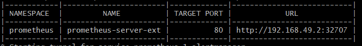

# Installing Prometheus and Grafana in Kubernetes from Helm

This guide provides instructions for installing Prometheus and Grafana in a Kubernetes cluster using Helm. Helm is a package manager for Kubernetes that simplifies the process of managing Kubernetes applications.

## Prerequisites

- Kubernetes cluster: Make sure you have a running Kubernetes cluster. You can use Minikube, a local Kubernetes cluster, for development and testing. Here I am using Minikube.
- Helm: Install Helm, the package manager for Kubernetes, on your local machine. Follow the [official Helm installation guide](https://helm.sh/docs/intro/install/) to set it up.
- Cluster access: Ensure you have the necessary permissions to install resources in the Kubernetes cluster.

## Installing Prometheus

1. **Add the Prometheus Helm chart repository:**
    ```shell
    helm repo add prometheus-community https://prometheus-community.github.io/helm-charts
    helm repo update
    ```

2. **Install Prometheus:**
    ```shell
    kubectl create ns prometheus
    helm install prometheus prometheus-community/prometheus -n prometheus
    ```

    This command installs Prometheus using the default configuration. You can customize the installation by passing additional options to the `helm install` command.

3. **Verify installation:**
    Check the status of the Prometheus pods to ensure they are running:
    ```shell
    kubectl get pods -l app=prometheus
    ```

## Installing Grafana

1. **Add the Grafana Helm chart repository:**
    ```shell
    helm repo add grafana https://grafana.github.io/helm-charts
    helm repo update
    ```

2. **Install Grafana:**
    ```shell
    kubectl create ns grafana
    helm install grafana grafana/grafana -n prometheus -n grafana
    ```

    This command installs Grafana using the default configuration. You can customize the installation by passing additional options to the `helm install` command.

3. **Verify installation:**
    Check the status of the Grafana pods to ensure they are running:
    ```shell
    kubectl get pods -l app=grafana
    ```

## Accessing Prometheus and Grafana

After installation, you may need to port-forward the Prometheus and Grafana services to access their UIs:

- **Prometheus UI**: Port forward the Prometheus service to your local machine:
    ```shell
     kubectl expose service prometheus-server --type=NodePort --target-port=9090 --name=prometheus-server-ext -n prometheus
    ```

    Access Prometheus UI by running following command.
    minikube service --all -n prometheus 
    Above command will Tunnel for all services and URL for port  forwarded services. 

- **Grafana UI**: Port forward the Grafana service to your local machine:
    ```shell
    kubectl expose service grafana --type=NodePort --target-port=3000 --name=grafana-ext -n grafana
    ```

    Access Grafana UI by running following command.
    minikube service --all -n grafana 
    Above command will Tunnel for all services and URL for port forwarded services.

    In Grafana we need to map the prometheus with Datasource
    In Datasource we have to give the Prometheus URL which we got from minikube service command as looks like below. 
    

    Create a grafana dashboard using prometheus datasource. 
    Here you can import the sample dashboard by using 3662 ID

## Conclusion

You have now successfully installed Prometheus and Grafana in your Kubernetes cluster using Helm. You can further configure these applications based on your requirements. Refer to the [Prometheus documentation](https://prometheus.io/docs/introduction/overview/) and [Grafana documentation](https://grafana.com/docs/grafana/latest/) for more information.
